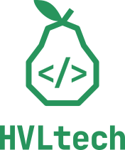
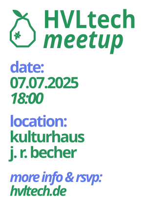
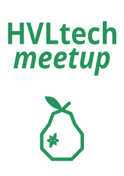

# HVLtech Design Assets

Design assets for **HVLtech** - Havelland Tech Community

🌐 [hvltech.de](https://hvltech.de)

---

## Brand Colors

<table>
<tr>
<td align="center">
<svg width="100" height="100" xmlns="http://www.w3.org/2000/svg">
  <rect width="100" height="100" fill="#27945c"/>
</svg>
<br/>
<strong>#27945c</strong>
<br/>
<em>Main Brand Color</em>
</td>
<td align="center">
<svg width="100" height="100" xmlns="http://www.w3.org/2000/svg">
  <rect width="100" height="100" fill="#607aeb"/>
</svg>
<br/>
<strong>#607aeb</strong>
<br/>
<em>Accent Color</em>
</td>
</tr>
</table>

- **Green (#27945c)** - Primary brand color used for the "HVLtech" text, logo elements, and main design elements
- **Blue (#607aeb)** - Accent color used for highlights and secondary elements

---

## Fonts

### JetBrains Mono
- **Ultra-Bold (font-weight: 800)** - Used for the main "HVLtech" branding text
- **Bold (font-weight: 700)** - Used for the `< / >` code symbols in the logo
- **Bold Italic** - Used for "meetup" text in event materials

### Geist Mono
- **Bold** - Used in poster designs for dates, locations, and information text
- **Bold Italic** - Used for time and additional information in posters

---

## Logos

### Logo with Text



**Downloads:**
- [SVG](logo/logo_with_text.svg) (vector, scalable)
- [PNG](logo/logo_with_text.png) (raster, 1000px)

---

### Logo without Text


**Downloads:**
- [SVG](logo/logo_no_text.svg) (vector, scalable)
- [PNG](logo/logo_no_text.png) (raster, 1000px)

---

## Meetup Materials

### 5th Meetup Poster



**Event Details:**
- Date: 07.07.2025
- Time: 18:00
- Location: Kulturhaus J. R. Becher

**Downloads:**
- [SVG](meetups/5th_meetup_poster.svg) (editable vector)
- [PDF](meetups/5th_meetup_poster.pdf) (print-ready)

---

### Entrance Poster



**Downloads:**
- [SVG](meetups/entrance_poster.svg) (editable vector)
- [PDF](meetups/entrance_poster.pdf) (print-ready)

---

## Repository Structure

```
design-assets/
├── logo/                    # Logo files
│   ├── logo_with_text.svg
│   ├── logo_with_text.png
│   ├── logo_no_text.svg
│   └── logo_no_text.png
└── meetups/                 # Meetup and event materials
    ├── 5th_meetup_poster.svg
    ├── 5th_meetup_poster.pdf
    ├── entrance_poster.svg
    └── entrance_poster.pdf
```
